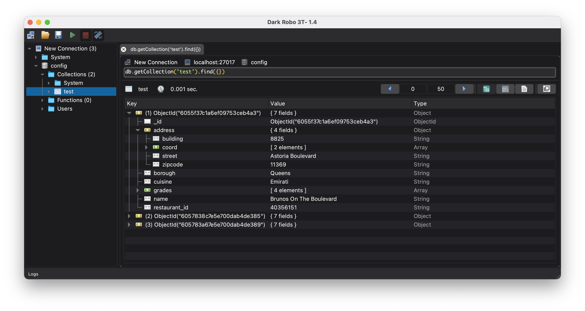

Dark Robo 3T
===============
Basic & personal project that is useful for me and might be useful for you.



Features
========
  - Based on [Robo 3T 1.4](https://github.com/Studio3T/robomongo)
  - Mac OS X 11 (Big Sur) only
  - Mongo shell v4.4.2  
  - Qt v5.12.10
  - OpenSSL v1.1.1f 
  - Dark Mode


Download
========

You can download installer packages for macOS [Here](https://github.com/d3skdev/dark-robomongo/releases/).

Troubleshooting
========
<h4>App quits unexpectedly ?</h4>

Try:
```
$ ((ls /usr/local/opt/openssl/lib/libssl.1.1.dylib &&\
 ls /usr/local/opt/openssl/lib/libcrypto.1.1.dylib) && echo Yes) || echo No
```
If "Yes" then:
```
$ ln -s /usr/local/opt/openssl/lib/libssl.1.1.dylib /usr/local/lib/
$ ln -s /usr/local/opt/openssl/lib/libcrypto.1.1.dylib /usr/local/lib/
```
If "No" then install openssl, then repeat step 1
```
brew install openssl
```


License
=======

Copyright 2014-2020 [3T Software Labs Ltd](https://studio3t.com/). All rights reserved.

This program is free software: you can redistribute it and/or modify
it under the terms of the GNU General Public License version 3 as 
published by the Free Software Foundation.

This program is distributed in the hope that it will be useful,
but WITHOUT ANY WARRANTY; without even the implied warranty of
MERCHANTABILITY or FITNESS FOR A PARTICULAR PURPOSE.  See the
GNU General Public License for more details.

You should have received a copy of the GNU General Public License
along with this program. If not, see <http://www.gnu.org/licenses/>.
